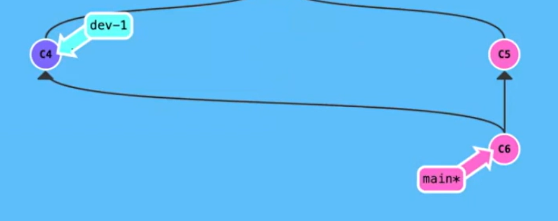

# Git使用

## 0关于git的ssh配置

https://www.bilibili.com/video/BV1qT4y1v7n1/?spm_id_from=pageDriver&vd_source=b0ad7a11a35f6bb99c79b79b455563fa

## 0-1王道：

```
https://docs.qq.com/doc/DRWhSWk50c0x4a2JM
```

## 1、git命令简便使用

### 1-0下载：直接去官网下载

### 1-1配置git(config)

```
git config -l //打印config
git config  user.name gzq
git config  user.email 2983624645@qq.com
git config --global user.name gzq
git config --global user.email 2983624645@qq.com
```

### 1-2从GitHub上下载源码

先创建一个空的文件夹，

在文件夹下，右键git bash，

然后用git clone命令

```
git clone xxx@xxxx.xxxx
```

### 1-3自己的项目(init)

先空白文件夹，

然后

```
git init
```

#### 3-1查看状态(status)

```
git status
```

一共有三种状态

##### 3-1-1：“untracked files”


##### 3-1-2：“changes to be committed”


##### 3-1-3:"modified"


##### 3-1-4:"working tree clean"


这里可再运行括号里提示的命令

```
git branch --unset-upstream
然后再 git status
```

### 1-4先add

'.':意味着当前目录所有文件

add的文件，是准备提交状态，添加到暂存区

```
git add .
```

### 1-5再commit

commit只是把代码提交到本地，要是想上传到服务器，还是得用push

```
git commit -m "在这里写备注"
git commit -a -m “在这里写备注” //把add 和commit 两个命令合并了
```

### 1-6最后push

push是上传到服务器

```
git push
```

### 1-7更新自己的库(pull)

```
git pull
```


### 1-8查看历史记录(log)

```
git log
git log -p
git log -p -1
git log -1
git log --online
```

### 1-9撤销commit

```
git reset
```


## 2、git多人开发


#### 2-1在远程服务器上创建一个共享版本库

1.项目负责人打开远程的服务器，然后创建一个工作区
2.在远程的服务器上打开工作区，在工作区中打开Git终端工具
3.在Git终端工具中输入 git init --bare

4.经过以上几步，就代表远程服务器上的共享版本库已经创建好了

#### 2-2开发人员下载远程版本库

1.开发人员在自己的电脑上打开Git终端工具

查看远程仓库

```
git remote
git remote -v
```

2.从远程的服务器上下载当前项目的共享版本库 

```
git clone xxx@xxx.xx.xxx （远程服务器共享版本库地址）
```

和单人开发使用Git的区别: 

> ​	单人开发是自己创建版本库，**而多人开发是从远程服务器下载版本库进入开发阶段**

#### 2-3进入开发阶段

和单人开发一样
1.设置用户名和邮箱
2.编写代码
3.添加到暂缓区

```
git add.
```

4.git commit -m 添加到HEADER指针指向的分支

```
git commit -m "xxxxxxx"
```

5.注意点:commit是将编写好的代码提交到本地的版本库，所以其它的开发人员是拿不到我们提交的代码的如果想让其它开发人员也能拿到我们提交的代码，还必须将编写好的代码提交到远程的服务器

------

**多人开发特有**：

6.将代码提交到远程的服务器 

```
git push
```

7.其它的开发人员只需要通过 git pull 就可以拿到更新的代码了

```
git pull
```


## 3、多人开发使用GIT注意

### 3-1不能将不能运行的代码提交

不能将不能运行的代码提交到本地和远程服务器(切记一定不能)

### 3-2如果更新出现时间冲突

如果服务器上有其它开发人员的更新内容，那么我们不能直接通过push将我们的代码提交到服务器

如果服务器上有其他开发人员更新的内容，我们必须先将其它开发人员更新的内容更新(pull)到本地之后才能push提交我们的内容

### 3-3如果更新出现内容冲突

如果我们更新的内容和其他同事更新的内容有冲突(修改了同一个文件的同一行代码)，这个时候需要我们自己手动修改冲突，修改完冲突后才能将代码提交到远程服务器

> git对冲突文件的处理：**都保留**

例：


### 3-4开发技巧：早提交代码                                           

只要开发完了一个功能就要立即提交代码，因为**在企业开发中谁后提交谁就负责解决冲突**

## 4、git分支特性

### 4-0：参考资料：

```
https://www.bilibili.com/video/BV19e4y1q7JJ/?spm_id_from=333.337.search-card.all.click&vd_source=b0ad7a11a35f6bb99c79b79b455563fa
```

### 4-1切换分支(checkout)

checkout 命令可以切换分支

```
git checkout HEAD xxx.xx //作用：从最后一次提交里把xxx.xx复制到工作区
git checkout -b  xxx          //创建并切换分支xxx(xxx是分支名字)
```

### 4-2查看所作改变（diff）

在提交或者合并之前，看看自己做的和源文件有何区别

```
git diff
```

### 4-3先更新main版本(checkout&pull)

```
git checkout main
git pull origin master
git checkout my-branch
```

### 4-4更新主分支到子分支(rebase)

**rebase一定程度上代替merge**

rebase的意思是把我的修改先都扔到一边，把main分支最新的修改拿过来，在最新添加/修改的子分支基础上，尝试把我的commit给弄到我的子分支里

注：在这个过程中有可能会出现rebase conflict，那此时需要你手动的选择你到底要哪一段代码

```
git rebase main
```

### 4-5合并分支 （merge）

##### 4-2-1 fast-foward merge

如图示：


结果：

****


先切换到main分支上（checkout）

然后再merge

```
git merge xxx
```

##### 4-2-2 typical merge

如图示：


结果：



### 4-6 上传（push）

由于我们做了rebase

所有我们在push的时候要加参数 -f（-f表示强行push）

```
git push -f origin my-branch
```

### 4-7把子分支内容合并到主分支内容（pull request）

你是一个子分支my-branch，你要把你的改动添加到主分支main-branch

所以

New pull request

### 4-8主分支更新(Squash and merge)

Squash and merge的意思，把这个节点的所有改变合并成一个改变，方便记录

### 4-9删除子分支（delete）

**按钮：delete branch**

删除本地子分支

```
git checkout main
git branch -D my-branch
git pull origin master //把主分支的更新同步到本地
```

